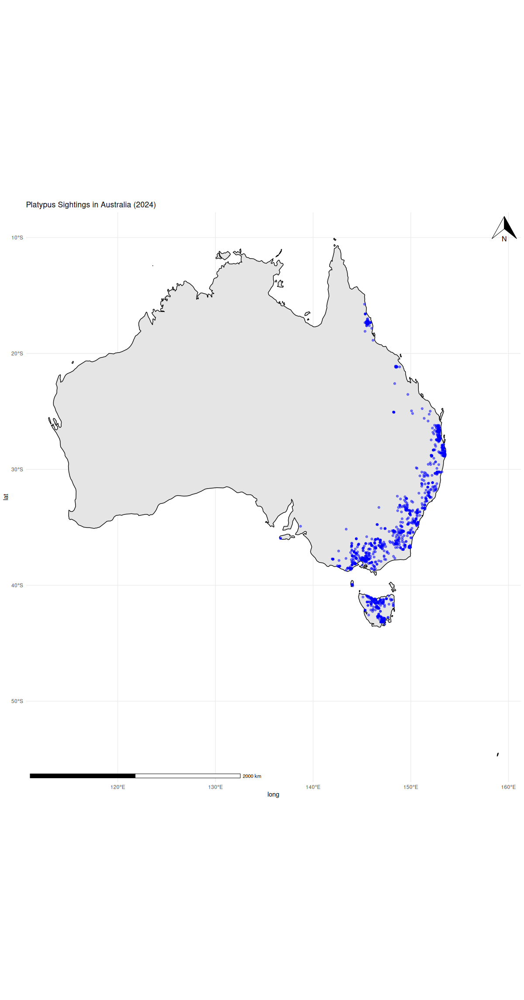

# TEST SUBMISSION FOR GSoC'25 ECOTOURISM

## EASY TASK

It plots the occurrence data in Australia from the Atlas of Living Australia using `galah` package. It creates a plot of the map of Australia using `ggplot2` and `ggspatial` package.

The plot looks like the following:-

