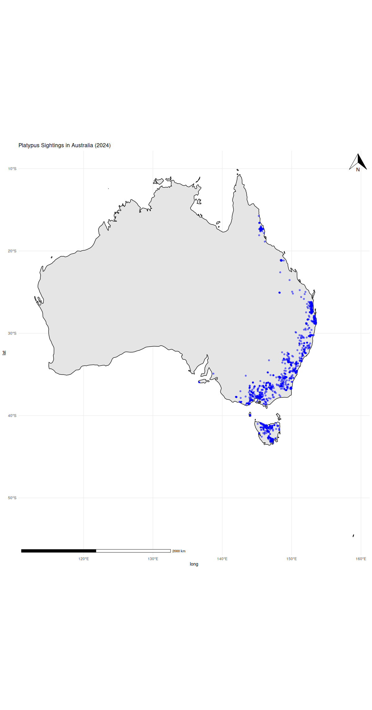
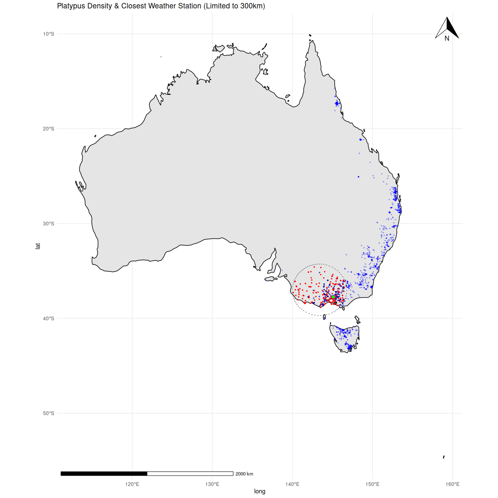

# TEST SUBMISSION FOR GSoC'25 ECOTOURISM

## EASY TASK

It plots the occurrence data in Australia from the Atlas of Living Australia using `galah` package. It creates a plot of the map of Australia using `ggplot2` and `ggspatial` package.

The plot looks like the following:-



## MEDIUM TASK

### Overview
In this test we analyze platypus sightings in Victoria, Australia, and retrieve weather data (temperature and precipitation) from the nearest weather station located in the **densest platypus sighting area**.

### Methodology
#### 1. **Plotting Platypus Occurrences**
We use the **galah R package** to obtain platypus occurrence records for the year **2024** and plot them on a map of Australia.

#### 2. **Finding the Central Location**
Using **Google**, I determined a central coordinate of Victoria, Australia:
   - **Latitude:** -36.9848
   - **Longitude:** 143.3906

To ensure sufficient coverage, we define a **radius of 300 km**, based on the approximate area calculation:


Thus, a **300 km radius** is used as a **safe parameter**.

#### 3. **Density Estimation (KDE Approach)**
We apply **Kernel Density Estimation (KDE)** to find the **most densely populated platypus sighting area**. This area is marked in **purple** on the map.

#### 4. **Finding the Nearest Weather Station**
The nearest weather station to this dense platypus region is identified at:
   - **Latitude:** -37.733
   - **Longitude:** 145.1
   - **Marked in Green** on the map.

#### 5. **Retrieving Weather Data**
Using the **GSODR package**, we retrieve **daily temperature and precipitation data** for **2024** from this weather station.
Additionally, we extract **PRCP_ATTRIBUTES**, which indicate the type of precipitation reports received:

| Code | Meaning |
|------|---------|
| A | 1 report of 6-hour precipitation amount |
| B | Summation of 2 reports of 6-hour precipitation amount |
| C | Summation of 3 reports of 6-hour precipitation amount |
| D | Summation of 4 reports of 6-hour precipitation amount |
| E | 1 report of 12-hour precipitation amount |
| F | Summation of 2 reports of 12-hour precipitation amount |
| G | 1 report of 24-hour precipitation amount |
| H | Station reported ‘0’ precipitation but recorded precipitation in hourly observations (possibly a trace) |
| I | No precipitation reported, but it may have occurred |

### Results
The final map generated shows:
- **Blue Dots**: Individual platypus sightings.
- **Purple Region**: Densest platypus sighting area (KDE approach).
- **Green Dot**: Nearest weather station to the densest platypus sighting area.



## HARD TEST

### Overview

This task involves geocoding Statistical Area Level 2 (SA2) regions by calculating their centroids using polygon coordinates from an ESRI shapefile. The centroid coordinates are then merged with a given dataset containing domestic trip statistics.

### Steps Involved

#### 1. Downloading the Dataset

The initial dataset was downloaded using the following command:

```sh
curl -O https://raw.githubusercontent.com/numbats/ecotourism/refs/heads/main/data-raw/domestic_trips_2023-10-08.csv
```

The dataset originally contained additional metadata that was removed to obtain a clean CSV structure:

```csv
Quarter,region,Trips(Holidays),Trips(Friends & Relatives),Trips(Business),Trips(Others),Total Trips,Misc
"March quarter 1998","Baulkham Hills - East",0,0,2.8986037,0,2.8986037,
,"Baulkham Hills (West) - Bella Vista",0,0,0,0,0,
,"Glenhaven",0,0,0,0,0,
,"West Pennant Hills",0,0,0,0,0,
.
.
.
```

#### 2. Obtaining SA2 Region Polygon Data

To calculate the centroids of SA2 regions, we used polygon coordinates from the **Australian Statistical Geography Standard (ASGS) Edition 3** dataset. The ESRI shapefile was obtained from the **Australian Bureau of Statistics (ABS):**

[Download SA2 ESRI Shapefile](https://www.abs.gov.au/statistics/standards/australian-statistical-geography-standard-asgs-edition-3/jul2021-jun2026/access-and-downloads/digital-boundary-files/SA2_2021_AUST_SHP_GDA2020.zip)

This file contains the polygon boundaries for SA2 regions, which were processed using **GeoPandas**.

#### 3. Calculating Centroids of SA2 Regions

Using Python and the **GeoPandas** library, we extracted the centroid coordinates for each SA2 region from the shapefile:

```python
import geopandas as gpd
import pandas as pd

# Load the shapefile
gdf = gpd.read_file('../SA2_2021_AUST_SHP_GDA2020/SA2_2021_AUST_GDA2020.shp')

# Create a list to store all the centroid data with their names
full_data = []

def compute_centroid():
    for i in range(0, 2473):
        # Extracts the SA2 region POLYGON geometry
        region = gdf.geometry[i]

        if region is None or region.is_empty:
            print(f"Skipping index {gdf.SA2_NAME21[i]} due to missing geometry.")
            x, y = "NA", "NA"
        else:
            x, y = region.centroid.x, region.centroid.y
        
        full_data.append({"name": gdf.SA2_NAME21[i], "lat": x, "long": y})
```

This script extracts the centroid coordinates and stores them in a structured format.

#### 4. Saving the SA2 Coordinates Dataset

The extracted data is saved into a CSV file:

```python
def save_to_csv():
    df = pd.DataFrame(full_data, columns=["name", "lat", "long"])
    df.to_csv("./generated_files/sa2_regions.csv", index=False, encoding="utf-8")
    print("Data saved to 'sa2_regions.csv'")
```

This ensures that the SA2 regions are correctly mapped to their centroid coordinates.

#### 5. Merging SA2 Coordinates with the Domestic Trips Dataset

Once the SA2 region coordinates were extracted, they were merged with the **domestic trips dataset** using **Pandas**:

```python
def merge():
    trips_df = pd.read_csv("domestic_trips_2023-10-08.csv")
    sa2_df = pd.read_csv("sa2_regions.csv")

    # Merge datasets based on region names
    merged_df = trips_df.merge(sa2_df, how="left", left_on="region", right_on="name")

    # Drop duplicate and irrelevant columns
    merged_df.drop(columns=["name", "Misc"], inplace=True)

    # Save the merged dataset
    merged_df.to_csv("./generated_files/domestic_trips_with_coords.csv", index=False, encoding="utf-8")
    print("Merged dataset saved as 'domestic_trips_with_coords.csv'.")
```

This results in a final dataset that contains all domestic trip statistics along with the respective SA2 centroid coordinates.

### Setting Up the Environment

To run the script, ensure you have the required Python libraries installed. We recommend using a virtual environment:

```sh
# Create and activate a virtual environment
python -m venv venv
source venv/bin/activate  # On macOS/Linux
venv\Scripts\activate  # On Windows

# Install required packages
pip install geopandas pandas
```

Once the environment is set up, execute the script to generate the final dataset.

### Final Output

The processed dataset is saved in the `generated_files` directory:

**File:** `domestic_trips_with_coords.csv`

```csv
Quarter,region,Trips(Holidays),Trips(Friends & Relatives),Trips(Business),Trips(Others),Total Trips,lat,long
March quarter 1998,Baulkham Hills - East,0.0,0.0,2.8986037,0.0,2.8986037,150.98804312011978,-33.7599737369399
,Baulkham Hills (West) - Bella Vista,0.0,0.0,0.0,0.0,0.0,150.96462746713868,-33.74248666591626
,Glenhaven,0.0,0.0,0.0,0.0,0.0,150.9988515807942,-33.702098348962416
,West Pennant Hills,0.0,0.0,0.0,0.0,0.0,151.0303012011925,-33.749978241437574
,Dural - Kenthurst - Wisemans Ferry,0.0,0.0,0.0,0.0,0.0,150.98231977134418,-33.54649284495859
.
.
.
```

### Conclusion

This task involved:

- Cleaning and structuring the domestic trips dataset.
- Extracting SA2 region boundaries and calculating centroids using GeoPandas.
- Merging the centroid coordinates with the domestic trips dataset.

By following these steps, I have successfully geocoded the SA2 regions and enriched the dataset with spatial data, making it more useful for geospatial analysis.